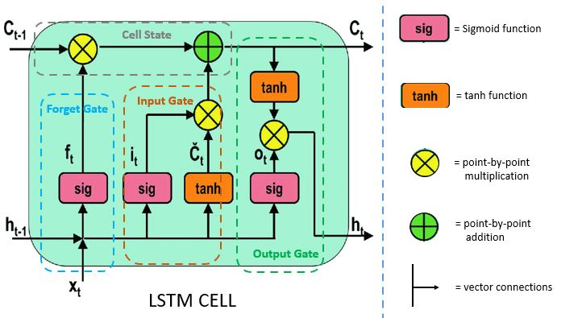
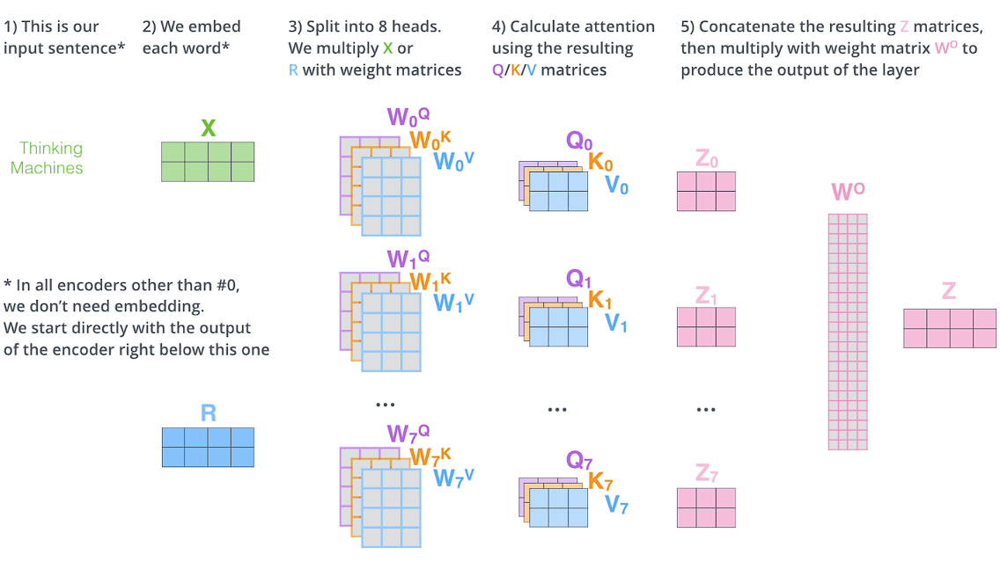

# Natural Language Processing

## NLP Models
### RNN 
- Processes sequences step-by-step
- Maintains a hidden state (memory)

$$h_t = f(x_t, h_{t-1})$$

Problems:
- Vanishing/explodinggradients 
- Poor long-range dependencylearning 

> Mostly obsolete in model NLP

### LSTM 
<figure>
  
  <!-- <figcaption>LSTM cell architecture</figcaption> -->
</figure>

Fixes RNN with gates to control what to remember/forget:
- Forget gate
- Input gate
- Output gate

It handles long dependencies better, but still sequential -> slow and hard to scale

> Rarely used in model NLP (except edge/legacy)


### Transformer
<!-- <figure>
    
</figure>

<figure>
    
</figure> -->

<div style="display: flex; gap: 20px;">
  <figure>
    
    <!-- <figcaption>Transformer Architecture</figcaption> -->
  </figure>

  <figure>
    
    <!-- <figcaption>Attention Mechanism</figcaption> -->
  </figure>
</div>

$$Attention(Q, K, V) = softmax(\frac{QK^T}{\sqrt{d}})V$$

Why it wins:
- Parallel (no recurrence)
- Captures long-range dependencies
- Scales to huge datasets 

> Foundation of ALL model NLP

#### ELMo
First contextual embeddings
- Based on bi-directional LSTM 
- Word meaning depends on context 


#### BERT 
BERT is a pretrained language model introduced in 2018 that learns deep contextual representations of text using a Transformer encoder
- Reads entire sentence at once 
- Uses self-attention to capture global context
> BERT reads text bidirectionally (both left and right context a the same time) 

**Training Objective**
BERT is an encoder-only Transformer pretrained on massive text using two key tasks:
- Masked Language Model (MLM)
  - Randomly mask ~15% of words `The cat is [MASK]`
  - Model predicts missing words by maximizing `P(masked tokens | context)`
- Next Sentence Prediction (NSP)
  - Given two sentences, predict if:
    - Sentence B follows Sentence A 

> MLM uses both left and right context, not autoregressive (unlike GPT)

BERT is not used directly, you fine-tune it to add a small task-specific layer:
- Classification -> linear layer on `[CLS]`
- QA -> predict start/end tokens 
- NEW -> token-level classifier 

Best for:
- classification
- search / retrieval
- QA

The typical pipeline:
1. Tokenize (WordPiece)
2. Add special tokens:
   1. `[CLS]` -> classification 
   2. `[SEP]` -> sentence separator 
3. Pass through BERT 
4. Use output embeddings for task 

**BERT Variants**
1. **mBERT** - multilingual BERT 
   1. one BERT model for 100+ language, trained on Wiki acorss languages
   2. zero-shot cross-lingual transfer 
   3. limitation: token fragmentation + imbalanced data 
2. **XLM/XLM-R**
   1. XLM needs parallel data 
3. **RoBERTa** - better BERT 
   1. More data, remove NSP, dynamic masking, longer training
4. **DeBERTa** - SOTA attention modeling 
   1. separates content and position 
5. **SBERT** - Sentence BERT
   1. > BERT is not good for sentence similarity
   2. Siamese / twin network + pairwise input + cntrastive loss 
   3. Output fixed-size sentence embedding, which can be computed for cosine similarity 
   4. Semantic search / clustering / retrieval
6. **SpanBERT** - QA-focused
   1. >Mask spans of text, not individual tokens
   2. Better for QA, span extraction, coreference


#### GPT (Decoder-only Transformer)
GPT is a unidirectional (causal) Transformer decoder designed for text generation. It predicts:
> next word given previous words
- Based on Transformer decoder 
- Uses causal masking -> cannot see future tokens
  - Autogregressive (predict next token)
  - Left-to-right only 

Best for:
- Text generation 
- Chatbots
- Coding 

#### T5 (Text-to-Text Transformer)
T5 converts every NLP task into a text-to-text problem. Full encoder + decoder Transformer:
> Input text -> output text 
- Encoder -> understands input 
- Decoder -> generates output

Unlike BERT (mask random words), T5 uses **Span Corruption**. Instead of masking individual tokens:
- Mask continuous spans
- Replace each span with a sentinel token like `<extra_id_0>`


#### Sentence Transformers
- Based on BERT
- Outputs sentence-level embeddings

Optimized for:
- Remantic similarity 
- Retrieval (RAG)
- Clustering 


---


| Problem     | Go-to Approach             |
| ----------- | -------------------------- |
| Sentiment   | BERT fine-tune             |
| NER         | BERT token classification  |
| Translation | Transformer                |
| Search      | Dense retrieval + reranker |
| Chatbot     | LLM (GPT-style)            |
| Similarity  | Sentence embeddings        |

## NLP Tasks

### Text Classification 
- Sentiment analysis (positive/negative)
- Spam detection 
- News topic classification 
- Content detection

Techniques:
- Classical: TF-IDF + Logistic Regression / SVM
- Deep laerning: CNN, RNN
- Modern: BERT-style models

Loss:
- Binary -> BCE/Logloss
- Multi-class -> CrossEntropy

> **TF-IDF (Term Freuqency - Inverse Document Frequency)**: A numerical statistic that measures how important a word is to a document within a collection
> It balances local importance and global rarity 


#### Sentiment analysis:
Model:
- Fine-tuned transformer
- BERT/FinBERT

Metrics:
- Accuracy 
- F1
- ROC-AUC 

> Class imbalance - neural dominates

---
### Sequence Labeling
The goal is to predict label per word/token 

- Named Entity Recognition (NER)
- Part-of-Speech tagging
- Chunking

Models
- CRF (classic)
- BiLSTM-CRF
- Transformer token classifier

> **POS Tagging**: Assigning a grammatical label to each word in a sentence. (e.g. NN, VB, JJ, RB, DT, IN)
> Rule-based, statistical models (HMM, CRF), Neural models (LSTM / Transformer)


> **NER**: Named Entity Recognition is an task that identifies and classifies real-world entities in text into predefined categories. Its a sequence labeling problem


#### ⭐ NER (Named Entity Recognition)
```
"Barack Obama was born in Hawaii"
```
- each token gets a label
- labels follow schemes like:
  - BIO: Begining / Inside / Outside
  - BIOES: adds End + Singel 


```
Barack   B-PER
Obama    I-PER
was      O
born     O
in       O
Hawaii   B-LOC
```

1. **data preparation**
   1. raw text + token-level annotations
2. **tokenization**
   1. Subword tokenization (e.g. BERT wordPiece)
   2. propagate label to all sub-tokens or only label first token 
3. **model architectures**
   1. BiLSTM + CRF `embedding -> BiLSTM -> CRF -> labels`
   2. Transformer + softmax/CRF `Tokens -> BERT -> Linear layer -> Softmax per token(or CRF)`
      1. BERT / RoBERTa / DeBERTa
      2. Finance-tuned variants (FinBERT)  
4. **training objective**
   1. token-level classification loss: cross-entropy over labels
      1. $\mathcal{L} = -\sum_i log P(y_i | x)$
   2. CRF sequence-level likelihood 
      1. $\mathcal{P(y|x)} = \frac{exp(score(x, y))}{\sum_{y'} exp(score(x, y'))}$
5. **datasets**
   1. CoNLL-2003 (20k news data; entities include PER, LOC, ORG, MISC)
   2. OntoNotes 5.0 (news, web text, conversational)
   3. WNUT-17 (social media)
6. **transfer learning**
   1. train on large corpora -> finetune on NER 
7. **data augmentation**
   1. synonym replacement
   2. entity swapping
   3. back translation 
8. **Metrics**
   1. Token-level: Precision/recall/F1
   2. Entity-level: Exact match F1 


> CRF = Conditional Random Field. A probablistic model for structured prediction - it predicts a sequence of labels jointly, not one-by-one 

>Synonym Replacement = replace words with similar meaning. Require POS tagging

> Back-Translation = translate to other language and translate back. Great for generates natural paraphrases

#### Event Extraction
Model:
- Two-stage
  - NER
  - Relation / event classifier 
- Modern:
  - Transformer-based sequence labeling
  - QA-style extraction (prompting)
  - Structured prediction heads

```
Input:  "Tesla acquired X for $2B"
Output:
  event = acquisition
  acquirer = Tesla
  value = $2B
```

Metrics:
- Trigger detection F1
- Argument extraction F1 
- End-to-end event F1

---
### Sequence-to-Sequence
The goal is to transform input text to output text 
> output length can be different from input length

- Machine translation
- Summarization
- Question answering
- Text generation
- Code generation 

**Models**
- Encoder-Decoder (RNN/LSTM)
- Attention mechanism
- Transformer (T5, BART)
  - T5: text-to-text framework
  - BART: denoising + generation

```
Input sentence
   ↓
Encoder (understands meaning)
   ↓
Context representation
   ↓
Decoder (generates output step-by-step)
```
**Encoder-Decoder architecture**
- Encoder reads the entire input sequence and converts it into a context semantic representation
  - in older models RNN/LSTM compresses everything into a single vector -> information loss
  - trasnformer encoder produces contextual embeddings for each token (self-attention)
- Decoder generates output one token at a time 
  - use previous generated tokens (masked self-attention)
  - encoder output - context (cross-attention)

**Training objective**
$$P(y_1, ..., y_T | x)$$

- Teacher forcing: feed ground truth previous token during training
- cross-entropy over each output token 

> Seq2seq is better with strong input conditioning since it builts a full contextual representation of input first, which is better at alignment tasks. Learns P(y|x)
> Decoder-only models mixes input + output and repeatedly attends over entire growing sequence, learns P(x, y) as one sequence

#### Summarization 
Used for:
- earnings call summaries
- news briefs

Models:
- seq2seq (T5, GPT-style)

#### Cross-lingual NLP 
Language differ in vocab, grammar, word order and scripts. But semantics are shared. The goal is to map them into a shared semantic space. 
- Multi-lingual pretraining (mBERT, XLM-RoBERTa)
  - Trained on Wiki from ~100+ languages, no explicit alignment
  - Uses shared WordPiece vocabulary
  - Shared model parameters
  - `same concept -> similar embeddings across languages`
- Machine translatino (classic approach)
  - Translate everything into one language 
  - Expensive and translation errors propagate
- Cross-lingual embeddings
  - The goal is to align embeddings across languages 
  - Word-level alignment: train embeddings separately, then align by learn mapping between them 
  - Joint training: train embeddings together 
- Parallel data 


---
### Question Answering (QA)
- Extractive (span from text)
- Generative (free-form answer)

Techniques
- BERT QA head (start/end span)
- Retriever + Reader (RAG-style)

---
### Retrieval & Ranking 
The goal is to find relevant documents 
- Search ranking
- Recommendation ranking
- News relevance

```
query -> retrieve candidates -> rerank
```

Techniques:
- BM25
- Dense retrieval (dual encoder)
- Cross-encoder reranking

Loss:
- pairwise ranking loss
- contrastive loss 
- cross entropy over candidates 

### Language Modeling
The goal is to predict next token / understand language 
- Autocomplete
- Chatbots

Techniques:
- N-grams (classic)
- Transformer LMs (GPT, BERT)

> GPT vs LaaMA vs Claude vs gemini??


### Embeddings & Similarity
The goal is to represent text as vectors 
- Semantic search
- Clustering
- Deduplication 

Techniques:
- Word2Vec / GloVe
- Sentence embeddings (SBERT)
- Contrastive learning


#### Embedding Models
Model:
- Sentence transformers (SBERT-style)
- Dual encoder (query/doc encoders)
- Contrastive learning models 

```
doc_vec = encoder(article)
query_vec = encoder(query)
```

Metrics:
- Recall @ K
- MRR (Mean Reciprocal Rank)
- NDCG (ranking quality)

```
Recall@10 = % of queries where correct doc is in top 10
```

#### Ranking Models

offline metrics:
- DNCG @ K
- MAP
- MRR

online metrics:
- CTR (click-through rate)
- dwell time 
- user engagement

>“Ranking is evaluated offline with NDCG and online with user engagement metrics like CTR.” 


---
## NLP Pipeline
### Step 1: Text preprocessing
- lowercasing
- tokenization
- stopword removal
- stemming / lemmatization
- handling punctuation 

Model transformer often skip heavy preprocessing

### Step 2: Representation 
**Classical**
- Bag-of-Words
- TF-IDF
- N-grams

> BoW probelm is order lost, sparse and huge vocab
> TF-IDF penalize common words and boost rare informative words
> N-grams capture local order

**Neural**
- Word embeddings (Word2Vec, GloVe)

**Contextual**
- Transformer embeddings (ELMo, BERT, GPT etc.)
> same word -> different vector depending on context

### Step 3: Modeling 
**Classifical ML Models**: Used with TF-IDF / BoW
- Logistics Regression 
- Naive Bayes
- SVM
- Random Forest 

**RNN/LSTM/GRU**
Capture sequence order  
- vanishing gradients
- slow
- hard parallelism

**Transformer**
Attention replaces recurrence
- parallel 
- captures long context 
- scalable

Use:
- Encoder-only -> classification (BERT)
- Decoder-only -> generation (GPT)
- Encoder-decoder -> seq2seq (T5)

### Step 4: Training
Loss:
- Cross-entropy (classification)
- Token-level loss (seq tasks)

Fine-tuning pretrained models 


Tokenization 
OOV problem 
Data annotation 
Imbalanced dataset


**Fine-tuning vs Pretraining**
- Pretrain on large corpus
- Fine-tune on task-specific data 
- Transfer learning: Use pretrained models -> adapt quickly 

**Data Techniques**
- Data augmentation (back translation, synonym replace)
- Handling imbalance (class weights, sampling)

**Retrieval-Augmented Generation (RAG)**
RAG combines retrieval + LLM, and is used in real systems (search, QA)
```
RAG = Retrieval + Generation 
```
1. Retrieves relevant documents from a knowledge source 
2. Uses them as context to generate a better answer 

> LLM like GPT have limitations where it hallucinate and have knowledge cutoff. RAG fixes this by injecting real, up-to-date information at inference. 
1. Index your data 
   1. Documents -> chunked into smaller pieces
   2. Convert to embeddings (vectors) using models (e.g. BERT, sentence-transformers, OpenAI embeddings)
   3. Store embeddings in a **vector database** (FAISS, Pinecone, etc.)
2. Retrieve
   1. User query -> converted to embedding
   2. Find top-k similar chunks via similarity search 
   3. Can be improved with hybrid search (BM25 + embeddings) and re-ranking models
3. Generate 
   1. Pass retrieved chunks + query into LLM
   2. LLM generates answer grounded in retrieved context
   3. GPT-style model takes context + query -> produces answer 

```
User Query
   ↓
Embedding
   ↓
Vector Search (Top-K docs)
   ↓
Context + Query
   ↓
LLM (Generate Answer)
```

### Step 5: Evaluation Metrics 
| Task           | Metrics         |
| -------------- | --------------- |
| Classification | Accuracy, F1    |
| NER            | Entity-level F1 |
| Retrieval      | MRR, MAP, NDCG, Recall @ K  |
| LM             | Perplexity      |
| Translation    | BLEU            |
| Summarization  | ROUGE           |
| QA             | Exact Match, F1          |


Classification 
- Accuracy 
- Precision/recall
- F1

Sequence labeling
- token-level F1 
- entity-level F1 

Ranking / Retrieval
- MRR - How early is the first correct results 
  - `MRR = average(1 / rank_of_first_relevant)` 
  - (rank 1 -> 1.0, rank 2 -> 0.5)
- NDCG - are important items ranked higher? 
  - `DCG = Σ (relevance_i / log2(rank_i + 1))`
- Recall @ k - Did we retrieve enough relevant items in top K
   - `Recall@K = (# relevant in top K) / (total relevant)`
- MAP - how good is the ranking overall 
  - compute precision at each relevant position 

Language Modeling
- Perplexity (PPL) - How surprised is the language model 
  - `PPL = exp(average negative log-likelihood)`

Generation 
- BLEU - Compare generated text with reference using n-gram precision 
- ROUGE - Compare overlap between generated summary and reference using recall
- human eval

| Aspect   | BLEU                  | ROUGE                 |
| -------- | --------------------- | --------------------- |
| Focus    | Precision             | Recall                |
| Task     | Translation           | Summarization         |
| Measures | correctness of output | coverage of reference |


## NLP Models 


## Embeddings
### TF-IDF
- Frequency weighted by rarity

$$\text{TF-IDF} = TF \times log(\frac{N}{DF})$$

### N-grams
- Sequences of tokens 

| Aspect            | Static       | Contextual               |
| ----------------- | ------------ | ------------------------ |
| Representation    | One per word | One per occurrence       |
| Context-aware     | ❌            | ✅                        |
| Handles ambiguity | ❌            | ✅                        |
| Model type        | shallow      | deep (transformers/RNNs) |


> Static embeddings assign a single vector per word, while contextual embeddings generate dynamic representations based on the sentence context, enabling better handling of ambiguity and meaning
--- 
## Transfer Learning
Pre 2018, LM are task-specific models with heavy feature engineering (TF-IDF, n-grams), which needed large labeled dtaasets per task 

Afterwards, the model is trained once on massive unlabeled text -> reuse everywhere 
- Massive performance gains 
- Reduced need for labeled dat a
- Unified architecture 
- Transfer learning: pretrain -> adapt -> deploy

| Method                | Data   | Cost   | Performance |
| --------------------- | ------ | ------ | ----------- |
| Continued pretraining | High   | High   | Best        |
| Fine-tuning           | Medium | Medium | Good        |
| Adapters              | Low    | Low    | Good        |


**Zero-shot learning**
> perform task without task-specific training 

- Model uses pretrained  knowledge
- Prompt defines the task `"Classify sentiment: I love this movie"`


**Few-shot learning**
> Learn task from a few examples in prompt 
- Model infers pattern from examples
- No gradient updates 


**LoRA (Low-Rank Adaptation)**
Full finetuning is expensive and lots of parameters updates. 
> Freeze original weights and learn low-rank updates. 

LoRA parameterize weight matrix into two small matrix with lower rank than full dimension 
- LLM fine-tuning
- Domain adaptation
- Personalization 


## Case Study: Bloomberg
1. Multi-source data ingestion 
   1. raw article, transcript, filing, social/alt data, market data
   2. ASR for audio -> text 
   3. cleaning, language detect, de-dup prefilter (hashing)
2. NLP enrichment 
   1. NER entity extraction + entity linking 
   2. event extraction
   3. sentiment analysis (doc or aspect-level)
   4. document classification (labels: earnings / macro / sector / geopolitics)
   5. summarization (seq2seq)
   6. embedding generation (from BERT, finBERT, or sentence-transformer)
   7. dedup / near-duplicate detection (minHash + embedding cosine. Keep one canonical doc + cluster IDs)
   8. clustering / topic grouping 
   9. anomaly detection (time + text signals)
3. Storage (multi-index)
   1. object store: raw text
   2. structured DB: entities, events, sentiment, labels, timestamps
   3. search index - keyword (inverted index, like Elasticsearch)
   4. vector index - embedding (FAISS / ANN index)
   5. Graph/lookup: entity registry (tickers, aliases)
4. Retrieval pipeline 
   1. query understanding
      1. NER on query -> TSLA
      2. intent detection -> earnings + time filter
   2. Hybrid retrieval - combine all candidates
      1. keyword search - look for exact matches
      2. structured filtering 
      3. vector retrieval - find nearest neigbbors
5. Ranking
   1. Features:
      1. keyword match score
      2. embedding similarity
      3. recency
      4. entity match
      5. sentiment
   2. Model:
      1. LTR (GBDT or neural)

| Method     | Strength      | Weakness       |
| ---------- | ------------- | -------------- |
| BM25       | precise, fast | no semantics   |
| Embedding  | semantic      | weak filtering |
| Structured | exact filters | no fuzziness   |


>“Embeddings are used for semantic recall, but structured signals like entities and timestamps are required for precision filtering and explainability.”

```
Raw text
  ↓
[NER] → entities
[Event extraction] → structured events
[Sentiment] → signal
[Embedding] → semantic vector
  ↓
Stored in:
  - structured DB
  - search index
  - vector index
  ↓
Retrieval:
  - keyword (BM25)
  - filters (entity/time)
  - embedding similarity
  ↓
Ranking model (LTR)
  ↓
User
```


```
                ┌────────────────────────────┐
                │     Data Sources           │
                │  News | Filings | Audio    │
                └────────────┬───────────────┘
                             ↓
                ┌────────────────────────────┐
                │   Ingestion & Cleaning     │
                │  ASR | Dedup (hashing)     │
                └────────────┬───────────────┘
                             ↓
        ┌──────────────────────────────────────────────┐
        │            NLP Enrichment Layer              │
        │  NER | Entity Linking | Event Extraction     │
        │  Sentiment | Classification | Summarization  │
        │  Embeddings                                 │
        └────────────┬─────────────────────────────────┘
                     ↓
   ┌─────────────────────────────────────────────────────────┐
   │                     Storage Layer                       │
   │  Object Store (raw text)                               │
   │  Structured DB (entities, events, sentiment, time)     │
   │  Inverted Index (BM25 search)                          │
   │  Vector Index (embeddings / ANN)                       │
   │  Entity Graph / Lookup (TSLA ↔ Tesla ↔ aliases)        │
   └────────────┬────────────────────────────────────────────┘
                ↓
        ┌────────────────────────────┐
        │     Query Understanding    │
        │  NER + intent + filters    │
        └────────────┬───────────────┘
                     ↓
        ┌────────────────────────────┐
        │     Retrieval Layer        │
        │  BM25 + Filters + Vectors  │
        └────────────┬───────────────┘
                     ↓
        ┌────────────────────────────┐
        │   Ranking (LTR model)      │
        │  (NDCG / CTR optimized)    │
        └────────────┬───────────────┘
                     ↓
        ┌────────────────────────────┐
        │   Output / UI Layer        │
        │  Results + Summaries       │
        │  Alerts + Analytics        │
        └────────────────────────────┘
```
