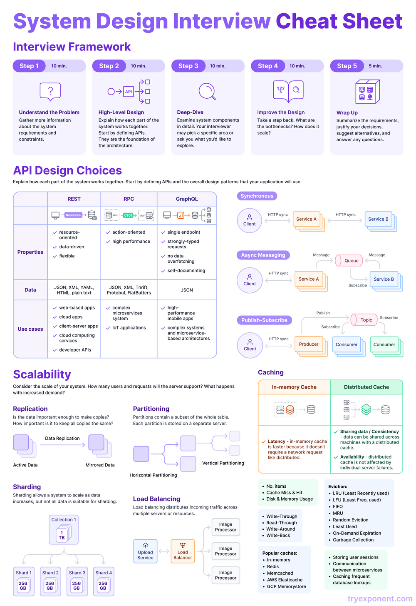
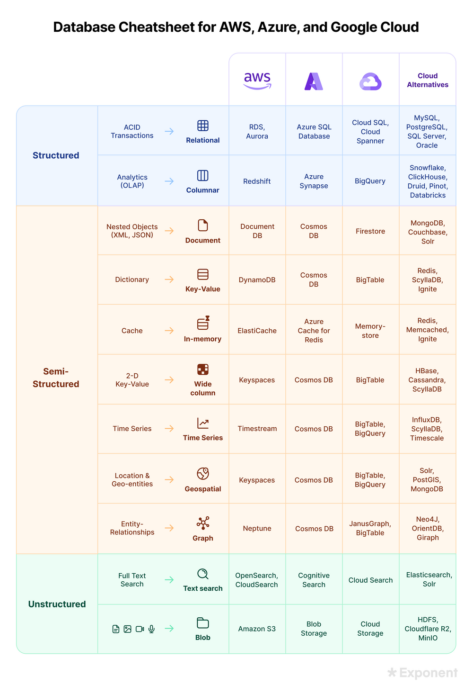
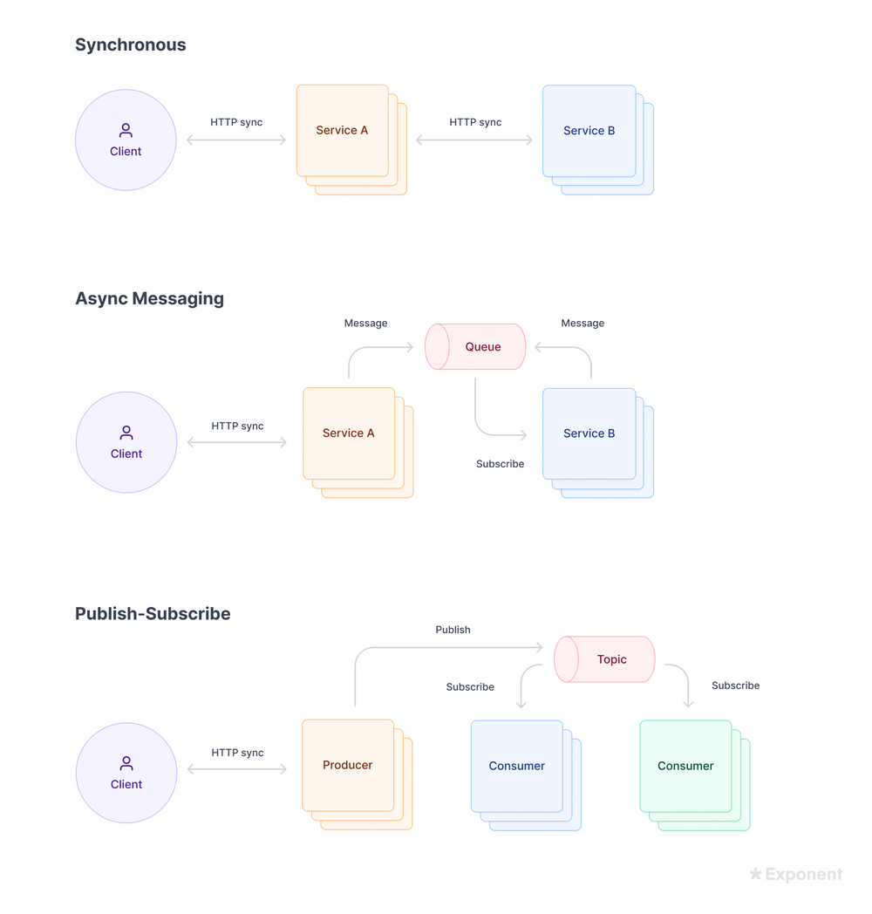
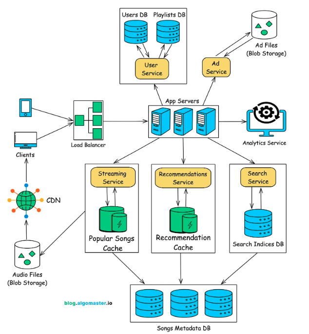

# System Design 

<figure>
  
  <!-- <figcaption>LSTM cell architecture</figcaption> -->
</figure>


1. Client: The user-facing inferface, like a web or mobile app, intiates requests

2. API gateway: the entry point for th ebackend. It manages incoming requests, handles authentication and authorization, enforces rate limiting, and routes traffic to the correct services

3. Application servers: often stateless, which can easily to scale horizontally

4. Databases: store persistent data. 

5. Cache: provide fast data access by storing frequently used results in memory with rools like Redis or Memcached

6. Message queues: Kafka or RabbitMQ handle aynchronous communication and load buffering. 

7. Load balancer: distributes traffic evenly across servers to prevent any single node from becoming a bottleneck


## Fundamental Concepts
### Client-Server Architectures 
Client -> server 
DNS server resolve domain name to IP address

Proxy / Reverse Proxy 

### Web Protocols
They include standards and rules for data exchange over a network, involving physical infra like servers and client machines. 

TCP/IP and OSI Models
TCP and UDP 
HTTP and HTTPS
TLS and WebSocket


Server-client communication 
| Method       | Connection Type   | Real-time?   | Efficiency |
| ------------ | ----------------- | ------------ | ---------- |
| AJAX Polling | Repeated requests | ❌ Not really | ❌ Low      |
| Long Polling | Held request      | ⚠️ semi-real  | ⚠️ Medium  |
| SSE          | One-way stream    | ✅ Yes        | ✅ Good     |
| WebSockets   | Full-duplex       | ✅ Yes        | 🚀 Best    |


#### HTTP
Request-response between client and server, require polling for real-time updates. 

#### Websockets 
The client initiate a websocket connection with the sever, once established, the connection remains open. The server can push updates to the client at any time without request. And client can send messages instantly to the servers, which eliminated polling. 

#### Webhooks 
When a server needs to notify another server


### API 
API are middle-man between client and servers. It has two major styles: REST and GraphQL 
```
client ---(request/response)--- API ------ servers
```

| Feature        | REST           | RPC            | GraphQL     |
| -------------- | -------------- | -------------- | ----------- |
| Style          | Resource-based | Function-based | Query-based |
| Endpoints      | Many           | Many           | Usually one |
| Flexibility    | Medium         | Low            | High        |
| Over-fetching  | Yes            | Sometimes      | No          |
| Learning curve | Easy           | Easy           | Medium/Hard |


> HTTP is a stateless protocol used for client-server communication. REST is an architectural style that uses HTTP methods to operate on resources identified by URLs

REST is stateless, but overfetching 
GraphQL lets clients ask for exactly, more complicated and harder to cache 


### Vertical Scaling vs Horizontal Scaling
**Vertical scaling**: adding more power (CPU, RAM) to your servers. 
- single point of failures
- lack scalability

**Horizontal scaling**: scale by adding more servers into your pool of resources
- need load balancer to distribute requests 


### Load Balancer
A load balancer evenly distributes incoming traffic among web servers that are defined in a load-balanced set. 
- **Round robin**: Assigns servers in a cyclic order, ensuring even distribution
- **Least connections**: Directs traffic to the server with the fewest active connections
- **Consistent hashing**: Routes requests based on criteria like IP address or URL, useful in maintaining user sessino consistency


### Cache 
A temporary storage are athat stores the result of expensive responses or frequently accessed data in memory so that subsequent requests are served more quickly

A caching layer like Redis can be used to store data temporarily, and use time-to-live value to keep cache fresh. 

### Database

Relational databases 
- MySQL
- Oracle
- PostgreSQL

Non-Relational databases
- Cassandra
- Amazon DynamoDb
- MongaDB
- Elasticsearch


**SQL database** is designed for predefined scheme follow ACID properties with structured relationship and strong consistency. 

**NoSQL database** is designed for high scalability, performance and flexible schema. 

- key-value store 
- document store 
- graph store
- wide-column


<figure>
  
  <!-- <figcaption>LSTM cell architecture</figcaption> -->
</figure>


- Structured: fixed schema such as rows and columns. 
  - tables, strict types
- Semi-structured: Flexible schema where fields can vary
  - JSON, nested objects
- Unstructured: No predefined schema 
  - Images, videos, logs 


SQL Database
- PostgreSQL
- MySQL


NoSQL Database 
- Key-Value Store (e.g. Redis)
  - Caching
  - Session storage
  - Fast lookup 
- Document Store (e.g. MongoDB)
  - User profiles
  - Flexible schemas
  - JSON-heavy apps 
- Wide-Column Store (e.g. Cassandra)
  - Rows with dynamic columns
  - Large-scale analytics
  - Time-series data 
- Graph Database (e.g. Neo4j)
  - Nodes + edges 
  - Social networks
  - Recommendation system 


#### Indexing
Speed up lookup but slow down write. 
> Avoid full table scan -> faster queries 

| Index Type | Use Case                     |
| ---------- | ---------------------------- |
| B-Tree     | Range, sorting, most queries |
| Hash       | Exact match only             |
| Inverted   | Text search                  |


#### Database Replication 
Database replication can be used in many database management system, usually with a master/slave relationship between the original and the copies. It scales read operations by having multiple read replicas. 

A master database generally only supports write operations. A slave database gets copies of the data from the master database and only supports read operations. All the data-modifying commands like insert, delete, or update must be sent to the master database. 

- Leader-Follower Replication 
  - Synchronous Replication 
  - Asynchronous Replication 
- Multi-leader Replication
- Leaderless Replication 


> Improve read scalability + fault tolerance 

| Type            | Description                        |
| --------------- | ---------------------------------- |
| Primary-Replica | Writes → primary, reads → replicas |
| Multi-primary   | Writes anywhere (more complex)     |


#### Sharding (across DB)
Involves dividing a large database into smaller, more manageable pieces, known as shards. Each hosted on separate servers. It's also called horizontal partitioningsince it splits data by rows. 
- Geo-based Sharding
- Range-based Sharding
- Hash-based Sharding 


Split data across multiple machines

> scale horizontally -> handle more data & traffic 

| Strategy  | Pros              | Cons               |
| --------- | ----------------- | ------------------ |
| Hash      | Even distribution | Hard range queries |
| Range     | Good for ranges   | Hotspots           |
| Directory | Flexible          | Extra lookup       |


#### Vertical Partitioning (Within DB)
Split a large table into smaller pieces inside the same database. 
> Split large tables -> scan less data 

≈

| Type  | Example | Use Case          |
| ----- | ------- | ----------------- |
| Range | by time | logs, events      |
| Hash  | user_id | even distribution |
| List  | region  | categorical       |


#### Denormalization 
Reduces the number of joins by combining related data into a single table. Used in read-heavy operation. 
- increased storage
- complex update request

#### Blob Storage 
Like Amazon S3 to store individual files like images, pdfs, videos. 
- automatic replication 
- pay as you go 
- scalability 

### Content Delivery Network (CDN)
A CDN is a network of geographically dispersed servers used to deliver static content. CDN servers cache static content like images, video, CSS, JavaScript files. 

When a user visits a website, a CDN server closest to the user will deliver static content


### CAP Theorem
No distributed system can achieve consistency, availability and partition tolerance. 

### Microservices 
As opposed to monolithic architecture, where everything live in a single code base, it breakdown the application to independent services. 

It can be scaled and deployed independently, and talk to other microservices using APIs or message queues. 

Direct API calls are't always efficient

### Message Queues
Synchronous communication doesn't scale while. Message queue allow services to communicate asynchronously.
- Kafka
- RabbitMQ
- AWS SQS  

### Rate Limiting
Prevent overload for public APIs and deployed services. 

Imagine a bot making thousands of request to your website which crash your server. Rate limiting restrict the number of requests a client can send within a specific time frame. Every user or IP address is assigned a quota like 100 requests per minute, and block additional requests temporarily. 
- fixed window 
- sliding window
- token bucket 

### API Gateway
Centralized service that handle authentication, rate limiting, logging, monitoring, and request routing to different microservices. Instead of exposing each service directly, an API gateway acts as a single entrypoint for all client requests to the appropriate microservice, and the response is sent back through the gateway to the client. 


### Idempotency 
Deals with retries and failures. 
Each request is assigned a unique IDs. Before processing, the system check if the request has already being handled, and ignore the duplicated requests if it has. 

### Improve Availability
- Redundancy 
  - Server redundancy 
  - Databae redundancy 
  - Geographic redundance
- Load balancing 
  - Hardware load balancers
  - Software load balancer 
- Failover Mechanisms
- Data Replication
- Monitoring and Alerts 
  - Heartbeat signals
  - Health checks 
  - Alerting systems 

--- 
## System Design Guide
### Step 1: Understand the problem 
Non-functional Requirements
- Performance: How fast is the system 
- Scalability: How will teh system respond to increased demand?
- Reliability: What's the system's uptime 
- Resilience: How will the system recover if it fails 
- Security: How are the system and data protected
- Usability: How do users interact with the system 
- Maintainability: How will you troubleshoot the system 

Data throughput estimation 
| Metric    | Measures       | Unit    | Intuition                    |
| --------- | -------------- | ------- | ---------------------------- |
| Storage   | Total data     | GB / TB | “How big is my database?”    |
| QPS       | Request rate   | req/sec | “How many users hitting me?” |
| Bandwidth | Data flow rate | MB/s    | “How heavy is traffic?”      |

**QPS (Queries per second)**
```
Daily Active Users = 1M 
Each user makes 10 requests / day 
Total requests / day  = 1M x 10 = 10M 

QPS = 10M / (24 x 3600)
    = 115 req/sec


Peak QPS = 2-5x avergae 
         = 300-500
```

**Storage**
- 1 image = 500 kB
- 1M uploads / day
- Retain for 30 days 

```
Storage = (data per item) x (items per day) x days 

Daily storage = 500KB x 1M = 500GB 
Total storage (30 days) = 500x 30 = 15TB 
```

**Bandwidth**
```
Bandwidth = QPS x data per request 

Bandwidth = 100 x 200KB = 20,000 KB/s = 20MB/s
```

### Step 2: API Designs 
Design API and establish a communication protocol

Select REST vs. SOAP vs. RPC, vs. GraphQL


### Step 3. Data Modeling
- Creating a simplified scehma that lists only the most important fields 
- Discussing data access patterns and the read-to-write ratio 
- Considering indexing options 
- Identify which database to use 

### Step 4. High-level Design 

- Transactions: If the system requires transactions, consider a database that offers the ACID property
- Data freshness: If an online system requires fressh data, think about how to speed up the data ingestion, processing, and query process
- Data size: If the data size is small enough to fit into memory (up to hundreds of GBs), you can place it in memory. Howeverm RAM is proneto data loss
- Partitioning: If the volume of data you need to store is large, you may want to partition the database to balance storage and query traffic. 
- Offline processing: If some processing can be done offline or delayed. You may want to reply on message queues and consumers
- Access patterns: revisit the data acess pattern, QPS number, read/write ratio, and consider how they impact your choieces for databases, scehmas, and indexing options. 

### Step 5. Optimization 
- Single points of failure
- Data replication 
- CDNs
- High traffic
- Scalability 


**Message Queues**
Ideal for scenarios where processing jobs in a specific order is essential. 

**Publish/Subscribe Systems**
Useful when disseminating events or notifications to a large number of recipients concurrently 

<figure>
  
  <!-- <figcaption>LSTM cell architecture</figcaption> -->
</figure>


## Example - Design Spotify 
**Requirements**
Functional Requirements:
- Search
- Music Streaming 
- Playlists
- Music Recommendations 
- Ad-Supported Model 

Non-functional Requirements:
- Scalability
- Low latency 
- High availability
- Global reach 

**Capacity Estimation**
Bandwidth estimation:
- Daily song streams: 100M users x 10 songs = 1 billion streams / day
- Data transfer per day: 1 billion x 5MB = 5 petabytes/day 
- Data transfer per seconds= 58GB / second

Storage Estimation:
- Total storage = 100million songs x 5MB/song = 500 TB 
- Total song metadata storage = 100 million songs x 2 KB = 200GB 
- Total storage for 500 milion users = 500 million x 10KB = 5 TB 

Caching Estimation:
- 20 million songs x 2KB / song = 40GB 

**High-level Designs**
<figure>
  
  <!-- <figcaption>LSTM cell architecture</figcaption> -->
</figure>

- Client application: mobile/desktop/web versions of spotify
- Load balancers: distributes incoming client requests 
- App servers: retrieve incoming requests from load balancer and redirects the request to the appropriate service 
- Services
  - Streaming service: Stream music from the storage system to user's devive in real-time
  - Search service
  - Recommendations service
  - Ad service
  - Users service: store and manages user profile and playlists. 
- Storage:
  - Databases: stores user profiles, playlists, song metadata and search indices
  - Blob storage: distributed storage system (AWS s3) for large-scale storage of audio and ad files 
- CDN: deliver large audio files efficiently to users across the globe with minimal latency 
- Caches: caches frequently accessed data such as popular songs and recommendations to improve performance. 
- Analytics service: track user engagement, system performance and logs system health. 

**Music Streaming Service**
1. Client sends a streaming request 
2. The App server authenticates
3. If the song is not in the CDN, retrieves the audio file's location and pushes the file to the nearest CDN edge server. The CDN returns a URL to the streaming service to stream the audio. 
4. The CDN URL is returned to the client, allowing the client to stream the audio


**Recommendation Service** 
IT uses a combination of collaborative filtering (based on users with similar preferences) and content-based filtering (based on song metadata).

Collaborative filtering:
- user-based collaborative filtering: if user A and user B like the same songs. 
- item-based collaborative filtering: if many users who like song X also like song Y. 

Content-based filtering:
- song attributes
- artist similarity 


**Search Service**
1. Query Parser
2. Search Index
3. Ranking Engine
4. Personalization layer 
5. Search Autocomplete
6. Cache layer
7. Search index updater


**Database Design**
Use relational database for structured data like user profiles, songs metadata, artists and albums. 

```
Users:
  user_id
  name
  email
  country
  subscription_type
  created_at
```

```
song_metadata
  song_id
  title
  artist_id
  album_id
  genre
  file_location
  duration
  release_date
```

Use NoSQL databases for unstructured and highly dynamic data such as recommendations and search indices 
- Recommendations table: generate recommendations for users based on their listening behavior and is frequently updated 
- Search indices: stored in NoSQL databases like Elasticsearch to allow quick and fuzzy search queries across songs, artists, and albums. 


Store large volume of audio and ad files using distributed storage system like AWS S3. 

**Content Delivery Network**

Use CDN for distributing large audio files to users globally with minimal latency 

By serving music from CDN edge servers, Spotify ensures low-latency music streaming experiences for users across the world. Original music files are stores in a distributed storage system. The CDN pulls from this origin storage when a song is requested for the first time and caches it for future requests. 

**Caching Layer**
Caching frequently accessed data like user preferences, popular songs, or recommendations can improve performance. (e.g. Redis)

- Search Queries: cache popular search queries to avoid hitting the search index repeatedly
- Popular songs
- User preference 

**Analytics and Monitoring**
Data is aggregated and processed in a data warehouse or distributed data stores (e.g. Hadoop, BigQuery).
- User engagement: data on streams, skips, and playlist additions 
- System monitoring: monitor system health, detect anomalies, and performance tuning
- Royalty calculations: calculate payments for artists based on song plays and geographic reach. 

**Key Issues and Bottlenecks**
Scalability:
- sharding: to scale the SQL databases and distribute the load, implement sharding for large tables like user, playlist and song metadata. 
- indexes: add indexes on frequently accessed fields like user_id and playlist_id to improve query performance
- partitioning: NoSQL databases can use partitioning strategies to distribute data across multiple nodes
- TTL: Cached data is given a TTl to ensure that stale data is regularly invalidated


Reliability:
- replicated databases: replicate user, song and playlists data across multiple data center to prevent data loss
- cache replication: Redis can be configured to replicate cached data across multiple instances for fault tolerance
- auto-scaling: automatically scale the number of servers based on traffic load
- graceful failover: if a server fails, traffic is rerouted to another server without service interruption
- monitoring and alerting

Security:
- authentication
- encryption
- rate limiting
- data provacy


## Resources
https://www.tryexponent.com/blog/system-design-interview-guide 

